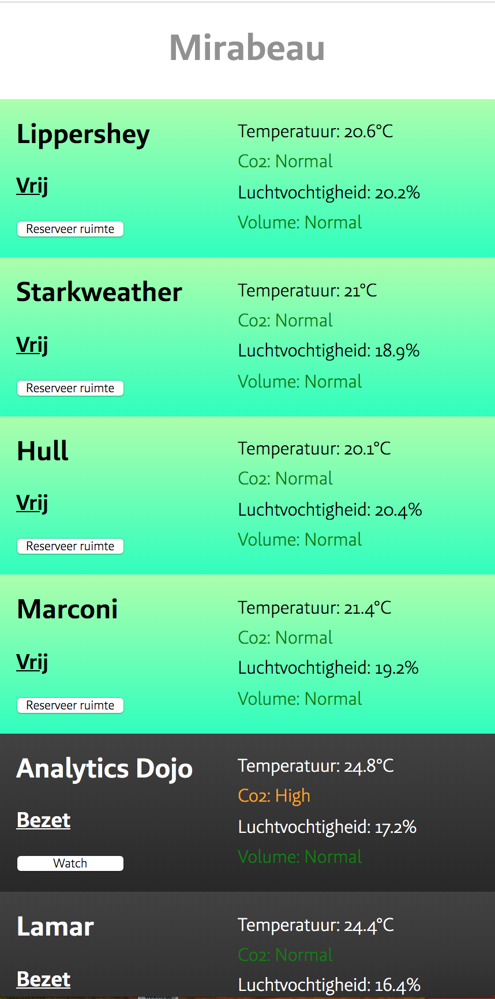

# Project 2 @cmda-minor-web · 2018-2019

## Mirabeau smart office

For this project we had to make a site to keep track of the meeting rooms at the Mirabeau office.
These meeting rooms contained several sensors for temperature, humidity, occupancy and volume.

## Live demo
[Live demo](https://mirabeau-smartoffice.herokuapp.com/) | [Repo](https://github.com/dorusth/project-2-1819)



## Installation
This project works with: node, express, handlebars, chalk, web-push and compression. Clone the repo with:
```bash
$ git clone https://github.com/dorusth/project-2-1819.git
```
to use the app use
```bash
$ npm install
$ npm start
```
and open "http://localhost:3030/"


## Features
- Room overview
- Booking free rooms
- Watch occupied rooms
- Notifications when the room is free


[MIT](LICENCE) © [Dorus ten Haaf](https://dorustenhaaf.com)
